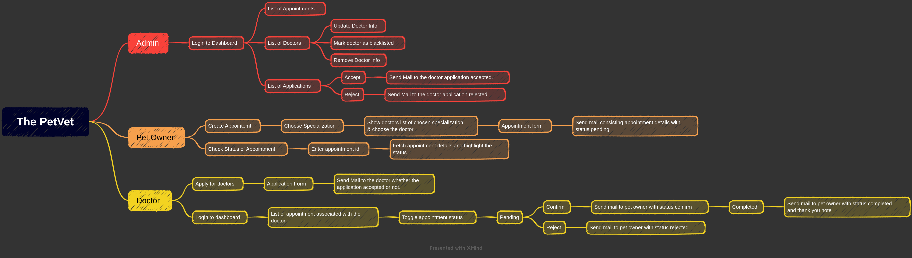

# The PetVet - A Veterinary Appointment Booking System

> Project Code : bizarre-quilt-7359  
> Frontend Deployed Link :  https://thepetvet.vercel.app/  
> Backend Deployed Link : https://thepetvet.cyclic.app/

## Introduction

The PetVet is an online application that allows pet owners to schedule appointments with veterinarians at their convenience. The system simplifies the process of booking appointments and provides a platform for pet owners to communicate with veterinary professionals regarding their pet's health. The system aims to improve the overall quality of care provided to pets by making it easier for pet owners to access veterinary services.

### Tech Stacks used

- Frontend: HTML, CSS, JavaScript and Bootstrap
- Backend: NodeJS, ExpressJS, MongoDB and NPM Packages

## Work Flow

## Endpoints

### Admin Authentication
    - Admin Register: /adminAuth/register
    - Admin Login: /adminAuth/login

### Admin
    - Get Doctors List(Method: GET): /admin/doctors
    - Get Doctor by ID(Method: GET): /admin/doctors?id=******
    - Get Appointment List(Method: GET): /admin/appointments
    - Get Appointment by ID(Method: GET): /admin/appointments?id=******
    - Update Doctor Info by ID(Method: PATCH): /admin/updateDoctor/:id
    - Remove Doctor Info by ID(Method: DELETE): /admin/removeDoctor/:id

### Appointment
    - Get Appointments List(Method: GET): /appointment
    - Get Appointments by ID(Method: GET): /appointment?id=****
    - Get Doctors List(Method: GET): /appointment/doctors
    - Create Appointment(Method: POST): /appointment/create

### Doctor Authentication
    - Doctor Register(Method: POST): /doctor/register
    - Doctor Login(Method: POST): /doctor/login